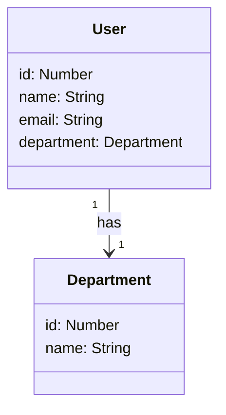

# <h1 align="center">User Department API com Spring Boot</h1>

### <h3 align="center">API que permite a criação de usuários com seu respectivo departamento. Projeto desenvolvido para o Desafio de Projeto do Bootcamp Santander na trilha Java + Angular Fullstack</h3>

 

 

## Features
- [x] Cadastro e remoção de usuários
- [x] Atualização do departamento de usuários.
- [x] Cadastro e remoção de departamentos

 

## Diagrama de Classes

